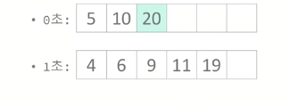
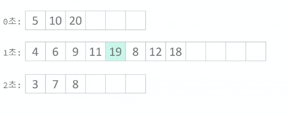
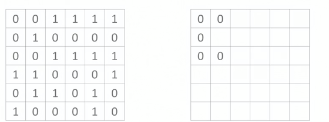
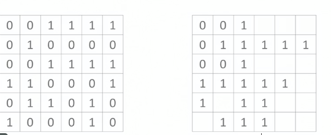
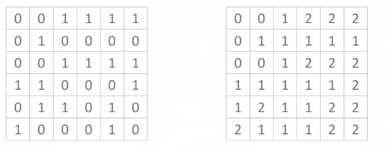

## BFS


- 목적 : **임의의 정점에서 시작**(시작점)해서, 모든 정점을 한 번씩 방문하는 것이다.
- BFS는 최단 거리를 구하는 알고리즘이다.
  - 언제? 모든 가중치가 1일때 최단거리를 구할 수 있다 . 
  - (단계별로 진행한다는 성질 때문)
- BFS를 이용해 해결할 수 있는 문제는 아래와 같은 조건을 만족해야 한다.
  - 1. 최소 비용 문제이여야 한다
    2. 간선의 가중치가 1이여야한다
    3. 정점과 간선의 개수가 적어야 한다 ( 적다는 것은 문제의 조건에 맞춰서 해결할 수 있다는 것을 의미한다 )
       - 간선의 가중치가 문제에서 구하라고 하는 최소 비용과 의미가 일치해야 한다
       - 즉, 거리의 최소값을 구하는 문제라면 가중치는 거리를 의미해야 하고, 시간의 최소값을 구하는 문제라면 가중치는 시간을 의미해야 한다.


### 숨바꼭질

- 수빈이의 위치 : N
- 동생의 위치 : K
- 동생을 찾는 가장 빠른 시간을 구하는 문제
- 수빈이가 할 수 있는 행동( 위치 : X )
  - 1. 걷기 X+1 또는 X-1로 이동( 1초 )
    2. 순간이동 : 2*X 로 이동 ( 1초 )


- BFS 로 문제를 푼다는 것 : 문제를 그래프로 바꾸어 푼다는 것
- 따라서 무엇이 정점이고 무엇이 간선의 의미를 가지는지 알아야 함

```JAVA
// check[i] = i 를 방문했는지
// dist[i] = i 를 몇 번만에 방문했는지
```

- now -> next 를 갔다고 하면

```java
if (check[next]== false){
    q.push(next);
	check[next]=true;
	dist[next] = dist[now]+1;
}
```


- 문제의 정답 : dist[m]


### 숨바꼭질 4

- 앞의 문제와 다 같다
- 이동하는 방법을 추가로 구한다
- 역추적 문제 : 어떤 값이 다른 값에 의해 바뀌었을 때, 왜 바뀌었는지 기록하는 것

```java
if (check[next]== false){
    q.push(next);
	check[next]=true;
    from[next]=now;
	dist[next] = dist[now]+1;
}
```

- 역추적 과정

  - from[i] = 어디에서 왔는지

  - 의미 : from[i] -> i

  - N에서 K를 가는 문제 이기 때문에

  - K부터 from 을 통해서 N까지 가야한다

  - 즉, 역순으로 저장되기 때문에, 다시 역순으로 구하는 것이 필요하다

    - 1. 재귀함수(n -> o -> o -> m)

    ```java
    print(int n, int m){
        if (n!=m){
            print(n, from[m])
        }
    }
    ```

    - 2. 반복문 사용

    ```java
    stack<int> ans;
    for(int i=m; i!=n; i=from[i]){
        ans.push(i);
    }
    ans.push(n);
    while(!ans.empty()){
        print(ans.top()+' ');
        ans.pop()
    }
    print()
    ```

    


- 위의 조건대로 파란 간선을 한 번만 사용할 수 있다면, 위 B와 아래 B는 같은 정점이라고 할 수 없다.

  - **어떤 정점이 같다**는 것은 연결되어 있는 간선이 같다는 것 인데.

  - 위의 B는 아래 간선으로만 이어진 것과 같고

  - 아래 B는 위 아래 간선으로 이어진 것과 같기 때문이다

    


- B(0) B(1)
  - 따라서 파란간선을 사용한 횟수를 기준으로 나눌 수 있다.
  - 이를 정점을 나눈다고 표현한다
  - 


## 이모티콘

- 화면에 이모티콘은 1개다
- 할 수 있는 연산
  - 화면에 있는 이모티콘을 모두 복사해서 클립보드에 저장
  - 클립보드에 있는 모든 이모티콘을 화면에 붙여넣기
  - 화면에 있는 이모티콘 중 하나를 삭제
- S 개의 이모티콘을 만드는 데 걸리는 시간의 최소값을 구하는 문제


- 정점을 ( S , C ) 로 정의한다.
  - 복사 : (s,c) -> (s,s)
  - 붙여넣기 : (s,c) -> (s+c, c)
  - 삭제: (s,c) -> (s-1,c)
  - 2<= S <= 1000 이기 때문에 BFS 탐색으로 가능하다.


# 덱 사용하기

- BFS : 가중치가 1 일때 사용하는 알고리즘
- 가중치가 0,1 일 때도 사용할 수 있다!

### 숨바꼭질 3

- 수빈이가 할 수 있는 행동 ( 위치 : X)
  - 1. 걷기 : X+1 또는 X-1 로 이동 (1초)
    2. 순간이동 : 2*X로 이동 (0초)





- 큐 2개 (현재 큐 /다음 큐)
- 덱을 사용해 순간 이동은 덱의 앞에, 걷기는 덱의 뒤에 넣는 방법도 있다
  - 현재 큐에 넣는 것을 덱의 앞에
  - 다음 큐에 넣는 것을 덱의 뒤에


### 알고 스팟

- 미로는 N*M 크기이고, 총 1x1 크기의 방으로 이루어 져 있다.

- 빈 방은 자유롭게 다닐 수 있지만, 벽은 부수지 않으면 이동할 수 없다.

- (x,y) 에 있을 때, 이동할 수 있는 방은 (x+1,y), (x-1,y), (x,y+1), (x,y-1) 이다

- (1.1) 에서 (N,M)으로 이동하려면 벽을 **최소 몇 개 부수어야** 하는지 구하는 문제

  - 빈칸 -> 빈칸 : 0

  - 빈칸 -> 벽 : 1 

    - 이렇게 정의를 내리면 가중치가 문제에 구하는 것과 같아지므로 BFS 사용 가능하다
    - 따라서 덱을 쓰거나 큐 2개를 사용하는 BFS로 구현 가능하다.

    





