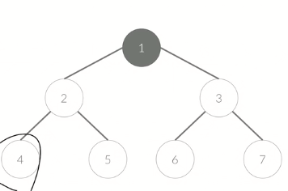
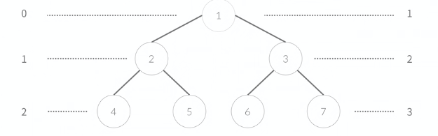

# 트리

> 트리에 대해서 알아보자

- 자료구조의 일종
- 사이클이 없는 연결 그래프
- 정점의 개수 : V
- 간선의 개수 : V - 1
- 서로 연결되어 있다

### 루트 있는 트리

- 루트가 있는 트리

- 1번이 루트이다

  

- 1번이 루트인 이유 : 내 맘 ( 4번이 루트라고 하면 4번이 루트이다 )

### 부모

- 1은 2의 부모
- 2는 4의 부모
- Parent 가 없는 정점 : 루트라고 표현

### 자식

- 2는 1의 자식
- 4는 2의 자식
- 3의 자식 : 6,7
- 4, 5, 6, 7 은 자식이 없는 정점이다

### 단말 정점

- 4. 5. 6.   7.

- 터미널 노드라고 한다
- Leaf Node 라고 한다

### 형제

- 4와 5는 형제
- 6과 7은 형제
- 2와 3도 형제
- 같은 부모를 가지면 형제

### 깊이

- 루트에서 부터 거리 (루트의 깊이를 0 으로 하는 경우와 1로 하는 경우가 있다)

### 높이

- 깊이 중 최대 값 2 또는 3

### 조상, 자손

- p -> q 로 루트를 통과하지 않고 갈 수 있을 때
- p 가 q 보다 루트에 가까우면
- p 는 q 의 조상
- q 는 p의 자손